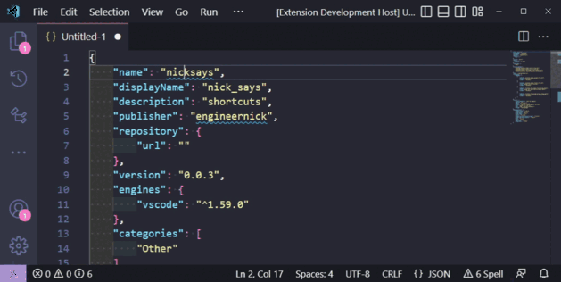
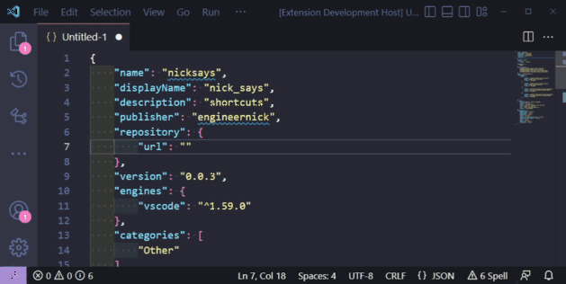
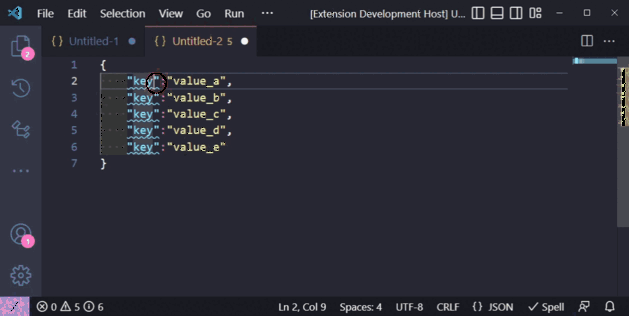

# Multi-Cursor Tools <!-- omit in toc -->

Use multi-cursor selections to do more!

- [1. Changes](#1-changes)
- [2. Usage](#2-usage)
  - [2.1. Command: `Left Align`](#21-command-left-align)
  - [2.2. Command: `Right Align`](#22-command-right-align)
  - [2.3. Command: `Number Cursors from ...`](#23-command-number-cursors-from-)
  - [2.4. Command: `Seek to Next Occurrence`](#24-command-seek-to-next-occurrence)
  - [2.5. Command: `Expand to Next Occurrence`](#25-command-expand-to-next-occurrence)

> Formally named "nick_says" then "Multi-Cursor-Align", now "Multi-Cursor
> Tools".

## 1. Changes

Please see the [Change Log](./CHANGELOG.md) for recent changes.

## 2. Usage

### 2.1. Command: `Left Align`

### 2.2. Command: `Right Align`

1. Open a vscode text editor or jupyter notebook text cell
2. Place multiple selections or multiple cursors (eg by using by using `Alt+Left Click` or `Ctrl+Alt+Up/Down Arrow` or other methods)
3. Press `Ctrl+Shift+P` to open the command search
4. Search for:
   - `Align Left Selections by Adding Spaces` OR
   - `Align Right Selections by Adding Spaces`
5. Spaces will be added before each cursor such that all cursors are now vertically aligned
   - Note: Weird stuff happens if there are two cursors on the same line, but it doesn't break anything; You can use Ctrl+Z to undo.

### 2.3. Command: `Number Cursors from ...`

1. Open a vscode text editor or jupyter notebook text cell
2. place multiple selections or multiple cursors (eg by using by using `Alt+Left Click` or `Ctrl+Alt+Up/Down Arrow` or other methods)
3. Press `Ctrl+Shift+P` to open the command search
4. Search for
   - `Number Cursors from Zero` OR
   - `Number Cursors from Arbitrary`
5. Numbers will be inserted at each cursor
   - starting at `0` or a prompt will ask for the starting number respectively
   - *ordered in the same way that cursors were created*

### 2.4. Command: `Seek to Next Occurrence`

Prompts for a search string, then moves current selection(s) forwards to the next occurrence, staying on the same line as the current selection(s) end.

*TODO: screencapture*

### 2.5. Command: `Expand to Next Occurrence`

Prompts for a search string, then expands current selection(s) forwards to before the next occurrence of the search string, staying on the same line as the current selection(s) end.

*TODO: screencapture*